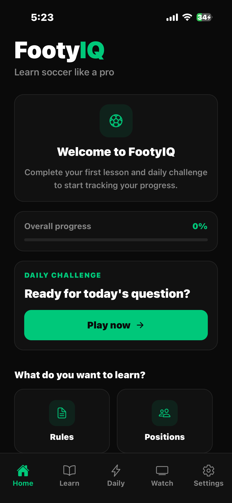
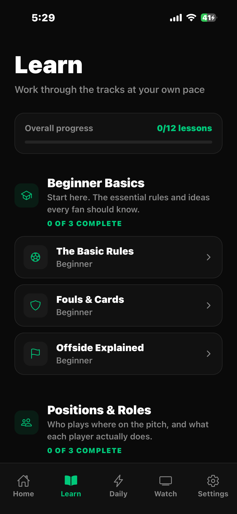
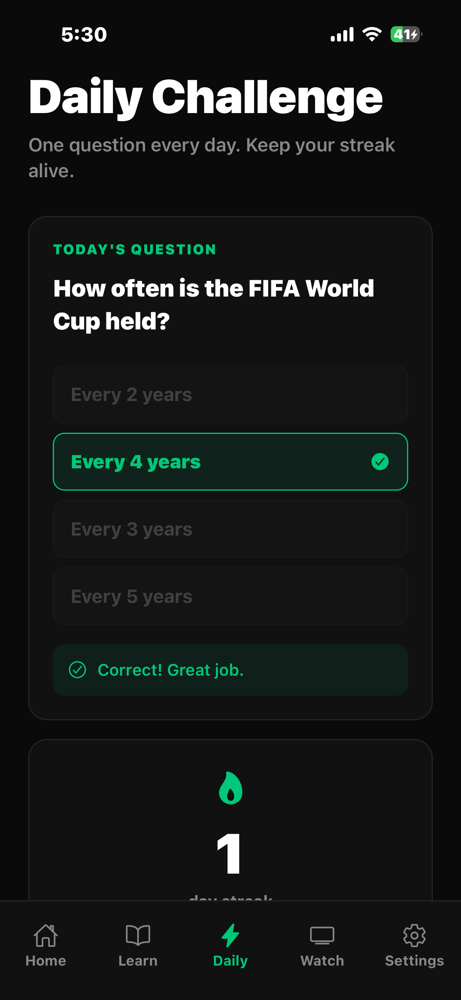
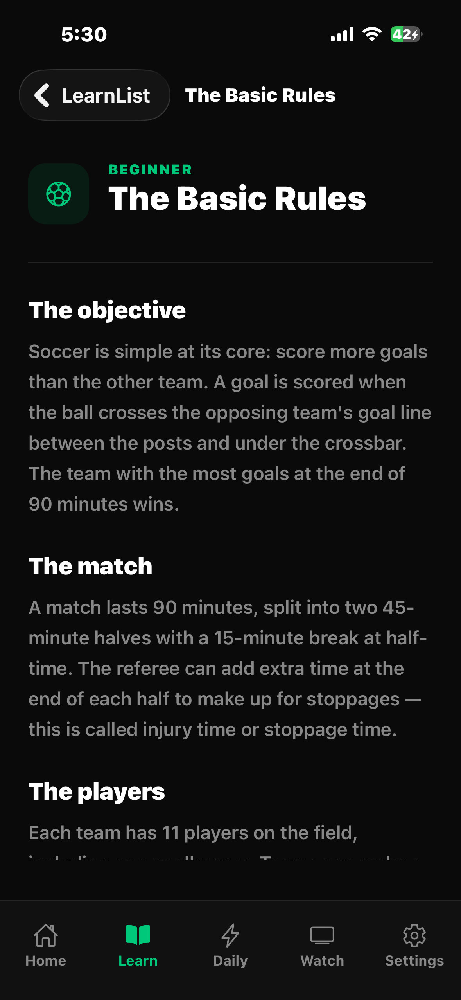
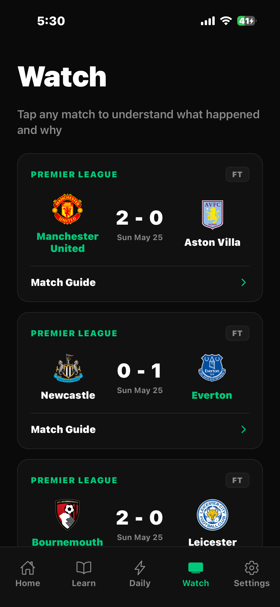
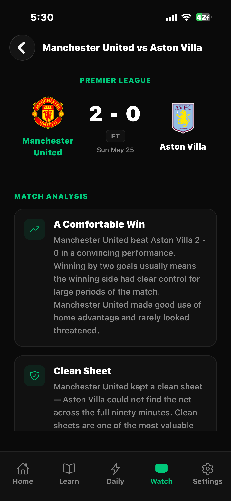

# FootyIQ ⚽

A soccer learning app that actually teaches you the game — the rules, the positions, the tactics — and then helps you read real match results like you know what you're looking at.

I built FootyIQ to get properly hands-on with React Native, and because most "learn football" content online is either too basic or assumes you already know everything. It's a portfolio project, not a commercial app, but I tried to build it like it mattered.

---

## Screenshots


| Home | Learn | Daily |
|------|-------|-------|
|  |  |  |

| Lesson | Watch | Match Guide |
|--------|-------|-------------|
|  |  |  |

---

## What it does

- **Lessons** — 12 of them across 4 tracks (basics, positions, tactics, history), each with a short quiz at the end.
- **Daily challenge** — one question a day that rotates, with a streak counter so you keep coming back.
- **Progress** — your completed lessons and streak save locally, and there's an animated progress bar that fills as you go.
- **Watch** — pulls real Premier League fixtures from API-Football, with pull-to-refresh and a skeleton loader while it fetches.
- **Match analysis** — every finished match gets a plain-English breakdown of what the result actually means. No jargon. This runs entirely off the score, no AI or paid API.
- **Glossary** — tap any tactical term anywhere in the app to see what it means.

The Learn, Daily, and Settings sections work without any setup. Only Watch needs an API key.

---

## Tech

React Native + Expo (SDK 54), React Navigation for the tabs and stacks, AsyncStorage for everything that persists, and API-Football's free tier for live data. Icons are Ionicons, animations use the built-in Animated API, and tests run on Jest via the `jest-expo` preset.

---

## How it's put together

```
src/
├── components/   shared UI — Card, ScreenWrapper, IconContainer, etc.
├── data/         lessons, quizzes, questions, glossary
├── hooks/        useProgress, useStreak
├── navigation/   tab navigator + Learn/Watch stacks
├── screens/      one file per screen
├── services/     footballApi (fetch + cache), matchAnalysis
└── theme/        colors + typography tokens
```

A few things I'd point out:

Every screen is built from the same set of components — `Card`, `ScreenWrapper`, `IconContainer`, `SectionLabel`, `PrimaryButton`. Early on I was writing the same styles over and over on each screen, so I pulled the repeated patterns into shared components and refactored everything onto them. Cleaned up a ton of duplicate `StyleSheet` code and made the whole thing look consistent.

Colours and font sizes all live in `src/theme` — no hard-coded hex values scattered around.

The free API tier is rate-limited, so fixtures get cached in AsyncStorage for six hours. Pull-to-refresh ignores the cache when you actually want fresh data.

`matchAnalysis.js` is a pure function — give it a score, it gives back the insights. I went rule-based instead of calling some AI API because it's free, instant, and I could actually write tests for it.

---

## Running it

You'll need Node, the Expo Go app on your phone (or a simulator), and a free API-Football key if you want the Watch section.

```bash
git clone https://github.com/MateenM10/FootyIQ.git
cd FootyIQ

npm install --legacy-peer-deps

cp config.example.js config.js
# paste your API-Football key into config.js

npx expo start
```

Then scan the QR code with Expo Go, or hit `i` / `a` for a simulator.

---

## Tests

```bash
npx jest
```

The match analysis logic is unit-tested — wins, draws, clean sheets, blowouts, the points context, all of it. It was the cleanest part of the app to test since it's a pure function.

---

## What I learned

Most of what I got out of this was the difference between something working and something being built well.

The component refactor was the big one. I didn't start with a shared system — I built a few screens, noticed I was copy-pasting the same card and button styles everywhere, and went back to fix it. Doing that refactor across the whole app taught me more about structuring a UI than any tutorial did.

Building around the API's limits was the other one. The free tier doesn't let you request just the latest fixtures, so I fetch the whole season once and filter on the client, then cache it to stay under the rate limit. Annoying at first, but figuring out a clean way around it was satisfying.

I also cut a feature. I had push notifications mostly working before realising they need a native build that doesn't play nice with the simple Expo Go setup I wanted people to be able to clone and run. Pulled it out. Knowing when to drop something is apparently a skill too.

---

## Development notes

I used AI tools (Claude) as a pair-programming assistant on this — mostly for talking through architecture decisions, speeding up repetitive refactors, and debugging. Every design decision, the feature scope, and what got cut were mine; I reviewed and understood everything that went in. Felt worth being upfront about, since it's how I actually work.

---

## Things I'd add next

- A dev build so notifications can come back
- More lessons and a bigger question pool
- Leagues beyond the Premier League
- Saved quiz scores and a stats screen

---

_Built with React Native & Expo._
